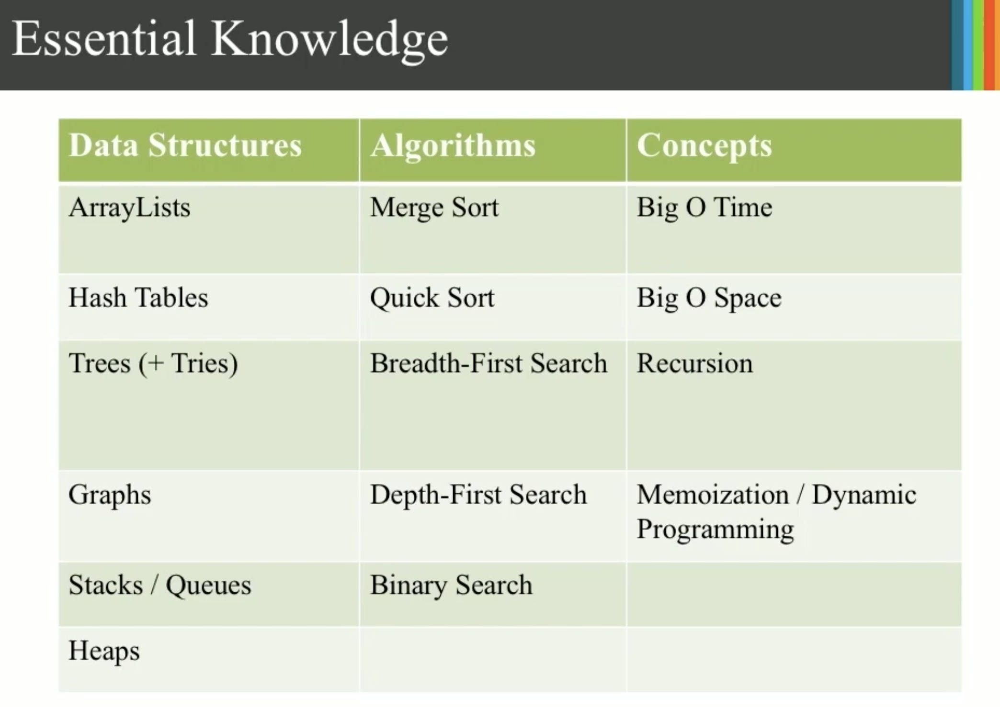
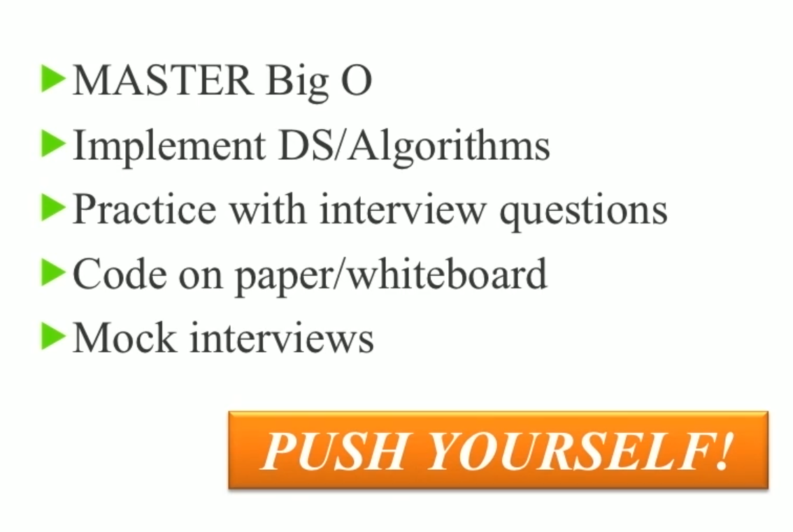

# Swift  playground

Useful resources:
[Algorithm club](https://github.com/raywenderlich/swift-algorithm-club)
[Big O](https://github.com/raywenderlich/swift-algorithm-club/blob/master/Big-O%20Notation.markdown)

## **Requirements for installation**
- Xcode 9 +
  
